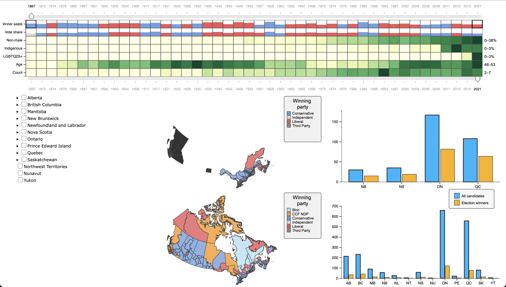

# Canada Federal Election Visualizer

[Demo is live here](https://rickycurry.github.io/547_project/vis_src/index.html).
[Video demo can be found here](https://www.youtube.com/watch?v=JsZ2bUVzE2o).
[Project report can be found here](https://www.cs.ubc.ca/~tmm/courses/547-25/projects/gale_ricky/report.pdf).

Note that the dashboard is ~~hacked together~~ built to run on a browser window with dimensions 1470×956 – default screen scaling for the 2022 M2 MacBook Air. If dashboard elements appear to be in the wrong screen locations, please reduce the size of your browser window and then refresh the page.

## Running the tool
You should be able to run the tool locally using some flavor of local server. We used [live-server](https://www.npmjs.com/package/live-server) during development to handle the CORS data-loading restrictions. (Alternatively, use the tool via the "live demo" link near the top of the README.)

## Repository outline

### `vis_src/`
Contains the source code for the visualization. `index.html` defines an HTML `div` element corresponding to each vis class instance, and also calls `vis_src/js/main.js`. `main` instantiates the various vis instances and coordinates state changes between them via callbacks.

#### `vis_src/js/external/`
Contains external package code, namely D3 and `d3-simple-slider` (credit to John Walley – see internal LICENSE and README).

### `data/`
Contains _candidate_ and _federal electoral district (FED)_ data in various stages of processing. The files that our tool uses are:
- `candidates/candidates_final.csv`, a tabular dataset representing each unique candidate-district-election item. Original files can be found [here](https://dataverse.harvard.edu/dataset.xhtml?persistentId=doi:10.7910/DVN/ABFNSQ) [Sevi, 2019];
- `candidates/lookup_tables/*` for mapping substituted numeric tokens back into their original strings for presentation;
- `feds/mapshaper_simplified_rewound_4326/*`, 18 historic sets of FED boundaries with names and unique IDs;
The [original files](https://borealisdata.ca/file.xhtml?fileId=449029&version=2.0) [Taylor et al., 2023] have been heavily simplified (around 2% of vertices retained), reprojected from [EPSG:3348](https://epsg.io/3348) to [EPSG:4326](https://epsg.io/4326) for compatibility with D3's [geography](https://d3js.org/d3-geo) module, and converted from Esri GIS format to GeoJSON;
- `feds/fed_hierarchy_complete.json`, which specify one-to-many mapping from each `RO_2013` FED to `RO_i` FEDs. They were derived by (algorithmically) identifying each historic FED that geometrically overlaps with each 2013 FED. Since nearly all FEDs have changed more or less drastically over time, the tool uses these mappings to derive geographically-corresponding FED selections for each historic RO.

### `data_processing/`
The data processing code is decidedly _not_ polished for public view. A motivated reader might be able to reverse-engineer a proper pipeline, but it would probably be easier to rewrite something decent from scratch. The main functions of the pipeline are (were) as follows, and are generally not discernable based on the current code state:
- Convert FEDs to EPSG:4326;
- Simplify and "re-wind" FED geometry – see `data_processing/mapshaper.sh`;
- Clean up FED metadata (make capitalization and punctuation uniform);
- Assign each _candidate_ datum to a FED/RO based on  FED name and election date (this was complex enough to warrant building a CLI tool to identify "orphaned" FEDs/candidates, rename FEDs based on closest string matching, and cross-reference with [Wikipedia's extensive data on inter-RO FED name changes](https://en.wikipedia.org/wiki/Historical_federal_electoral_districts_of_Canada)... the data cleanup stage was a somewhat painful process);
- Generate the aforementioned one-to-many FED mapping that powers the historical FED selection logic;
- Generate a nested hierarchy of geography (Province ->[Population center] -> FED) to populate the FED selector tool (this involved manually generating a JSON-formatted hierarchy of FEDs by ID based primarily on the insets from [this 2021 election outcome map](https://en.wikipedia.org/wiki/2021_Canadian_federal_election#/media/File:Canada_Election_2021_Results_Map.svg) – credit to [Eric Tian](https://commons.wikimedia.org/wiki/User:Eric0892) – and filling in the names and non-urban FEDs programmatically).

All geographic data processing was performed using the Python [GeoPandas](https://geopandas.org/en/stable/) module, except the aforementioned shape simplification and re-winding, which used [`mapshaper-xl`](https://github.com/mbloch/mapshaper) (credit to [Matthew Bloch](https://github.com/mbloch)).
